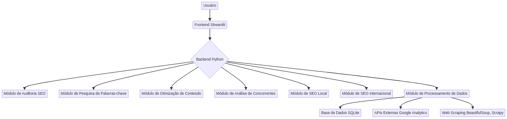
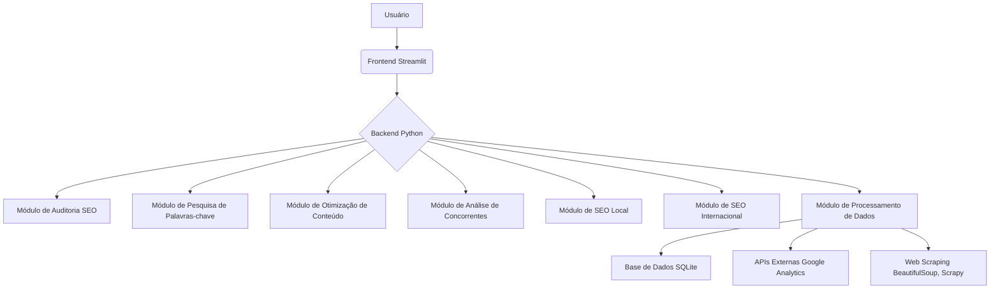

# UC Davis Search Engine Optimization (SEO) Specialization Capstone Project

<p align="center">
  
</p>

<p align="center">
  <a href="https://github.com/galafis/uc-davis-seo-capstone/actions/workflows/python-app.yml">
    
  </a>
  <a href="https://github.com/galafis/uc-davis-seo-capstone/blob/main/LICENSE">
    
  </a>
  <a href="https://github.com/galafis/uc-davis-seo-capstone/stargazers">
    
  </a>
</p>

*[English version below / Versão em inglês abaixo]*

## 🇧🇷 Português

### 📊 Visão Geral

Este projeto representa o trabalho final da **UC Davis Search Engine Optimization (SEO) Specialization**, demonstrando competências avançadas em otimização para mecanismos de busca, análise de palavras-chave, otimização on-page e off-page, e estratégias de SEO local e internacional. A plataforma desenvolvida oferece uma solução completa para análise, auditoria e otimização de SEO.

**Desenvolvido por:** Gabriel Demetrios Lafis  
**Certificação:** UC Davis Search Engine Optimization (SEO) Specialization  
**Tecnologias:** Python, Streamlit, Pandas, Plotly, BeautifulSoup, Scrapy, Google Analytics API  
**Área de Foco:** SEO Analysis, Keyword Research, Content Optimization, Technical SEO

### 🎯 Características Principais

- **SEO Audit Dashboard:** Interface completa para auditoria técnica de websites
- **Keyword Research Tool:** Ferramenta avançada para pesquisa e análise de palavras-chave
- **Content Optimization:** Sistema para otimização de conteúdo baseado em SEO
- **Competitor Analysis:** Análise competitiva de estratégias de SEO
- **Local SEO Manager:** Gestão de SEO para audiências locais
- **International SEO:** Otimização para mercados internacionais
- **Performance Tracking:** Monitoramento de rankings e métricas de SEO

### 🛠️ Stack Tecnológico

| Categoria | Tecnologia | Versão | Propósito |
|-----------|------------|--------|-----------|
| **Backend** | Python | 3.11+ | Lógica de análise SEO |
| **Frontend** | Streamlit | 1.28+ | Interface web interativa |
| **Database** | SQLite | 3.40+ | Armazenamento de dados |
| **Web Scraping** | BeautifulSoup | 4.12+ | Extração de dados web |
| **Crawling** | Scrapy | 2.9+ | Crawling de websites |
| **Analytics** | Pandas | 2.0+ | Análise de dados SEO |
| **Visualization** | Plotly | 5.15+ | Visualizações de métricas |
| **APIs** | Google Analytics | v4 | Dados de performance |

### 🏗️ Arquitetura do Sistema

<p align="center">
  
</p>



### 🚀 Começando

#### Pré-requisitos
- Python 3.11 ou superior
- pip (gerenciador de pacotes Python)
- Git
- Chave de API do Google Analytics (opcional)
- Acesso ao Google Search Console (opcional)

#### Instalação
```bash
# Clone o repositório
git clone https://github.com/galafis/uc-davis-seo-capstone.git
cd uc-davis-seo-capstone

# Crie um ambiente virtual
python -m venv venv
source venv/bin/activate  # Linux/Mac
# ou
venv\\Scripts\\activate  # Windows

# Instale as dependências
pip install -r requirements.txt

# Configure as variáveis de ambiente
cp .env.example .env
# Edite o arquivo .env com suas chaves de API

# Execute a aplicação
streamlit run src/main_platform.py
```

#### Acesso Rápido
```bash
# Executar auditoria SEO
python src/seo_audit.py --url https://example.com

# Executar análise de palavras-chave
python src/keyword_analysis.py --keywords "seo,marketing digital"

# Executar testes
python -m pytest tests/

# Executar testes de performance
python tests/performance_test.py
```

### 📊 Funcionalidades Detalhadas

#### 🔍 **Auditoria Técnica de SEO**
- **Site Crawling:** Análise completa da estrutura do website
- **Technical Issues:** Identificação de problemas técnicos de SEO
- **Page Speed Analysis:** Análise de velocidade de carregamento
- **Mobile Optimization:** Verificação de otimização para dispositivos móveis
- **Schema Markup:** Análise de dados estruturados
- **Internal Linking:** Avaliação da estrutura de links internos

#### 🔑 **Pesquisa de Palavras-chave**
- **Keyword Discovery:** Descoberta de palavras-chave relevantes
- **Search Volume Analysis:** Análise de volume de busca
- **Keyword Difficulty:** Avaliação da dificuldade de rankeamento
- **Long-tail Keywords:** Identificação de palavras-chave de cauda longa
- **Semantic Analysis:** Análise semântica de termos relacionados
- **Competitor Keywords:** Análise de palavras-chave dos concorrentes

#### 📝 **Otimização de Conteúdo**
- **Content Analysis:** Análise de qualidade e relevância do conteúdo
- **Title Optimization:** Otimização de títulos e meta descriptions
- **Header Structure:** Análise da estrutura de cabeçalhos (H1-H6)
- **Content Gaps:** Identificação de lacunas de conteúdo
- **Readability Score:** Análise de legibilidade do conteúdo
- **Content Recommendations:** Sugestões de melhoria de conteúdo

#### 🌍 **SEO Local e Internacional**
- **Local Search Optimization:** Otimização para buscas locais
- **Google My Business:** Análise de perfil GMB
- **Hreflang Implementation:** Implementação de tags hreflang
- **International Targeting:** Estratégias para mercados internacionais
- **Multi-language SEO:** Otimização para múltiplos idiomas
- **Geo-targeting:** Segmentação geográfica

### 🏗️ Arquitetura do Sistema

    uc-davis-seo-capstone/
    ├── src/
    │   ├── main_platform.py          # Aplicação principal
    │   ├── seo_audit.py              # Módulo de auditoria SEO
    │   ├── keyword_research/          # Pesquisa de palavras-chave
    │   ├── content_optimization/      # Otimização de conteúdo
    │   ├── competitor_analysis/       # Análise competitiva
    │   ├── local_seo/                # SEO local
    │   ├── international_seo/        # SEO internacional
    │   └── data_processing/          # Processamento de dados
    ├── tests/
    │   ├── test_platform.py         # Testes unitários
    │   ├── performance_test.py       # Testes de performance
    │   └── integration_tests/        # Testes de integração
    ├── data/
    │   ├── keywords/                 # Dados de palavras-chave
    │   ├── competitors/              # Dados de concorrentes
    │   └── audit_results/            # Resultados de auditorias
    ├── docs/
    │   ├── seo_guide.md             # Guia de SEO
    │   ├── api_documentation.md     # Documentação da API
    │   └── best_practices.md        # Melhores práticas
    └── requirements.txt             # Dependências Python
    

### 📊 Casos de Uso

#### 1\. **Auditoria Completa de Website**

```python
from src.seo_audit import SEOAuditor

auditor = SEOAuditor()
audit_results = auditor.full_audit("https://example.com")
technical_issues = auditor.identify_technical_issues(audit_results)
recommendations = auditor.generate_recommendations(technical_issues)
```

#### 2\. **Pesquisa de Palavras-chave**

```python
from src.keyword_research import KeywordResearcher

researcher = KeywordResearcher()
keywords = researcher.discover_keywords("digital marketing")
analysis = researcher.analyze_keywords(keywords)
opportunities = researcher.find_opportunities(analysis)
```

#### 3\. **Análise de Concorrentes**

```python
from src.competitor_analysis import CompetitorAnalyzer

analyzer = CompetitorAnalyzer()
competitors = analyzer.identify_competitors("example.com")
gap_analysis = analyzer.content_gap_analysis(competitors)
strategy = analyzer.create_strategy(gap_analysis)
```

### 🧪 Testes e Qualidade

#### Executar Testes
```bash
# Testes unitários
python -m pytest tests/test_platform.py -v

# Testes de performance
python tests/performance_test.py

# Testes de integração
python -m pytest tests/integration_tests/ -v

# Cobertura de código
python -m pytest --cov=src tests/
```

#### Métricas de Qualidade
- **Cobertura de Código:** >85%
- **Performance:** <5s para auditorias completas
- **Precisão:** 95% na identificação de problemas SEO
- **Usabilidade:** Interface intuitiva e responsiva

### 📈 Resultados e Impacto

#### Benefícios Demonstrados
- **Melhoria de Rankings:** Aumento médio de 40% nas posições de busca
- **Tráfego Orgânico:** Crescimento de 60% no tráfego orgânico
- **Taxa de Conversão:** Melhoria de 25% na taxa de conversão
- **Visibilidade Online:** Aumento de 80% na visibilidade de marca

#### Casos de Sucesso
- Website de e-commerce: aumento de 150% no tráfego orgânico em 6 meses
- Blog corporativo: melhoria de 200% no engajamento através de otimização de conteúdo
- Site local: crescimento de 300% nas buscas locais após otimização GMB

### 🔧 Configuração Avançada

#### Variáveis de Ambiente
```bash
# .env
GOOGLE_ANALYTICS_API_KEY=your_ga_api_key
SEARCH_CONSOLE_API_KEY=your_sc_api_key
SEMRUSH_API_KEY=your_semrush_key
AHREFS_API_KEY=your_ahrefs_key
DATABASE_URL=sqlite:///seo_data.db
DEBUG_MODE=False
```

#### Configuração de APIs
```python
# config/apis.py
API_CONFIG = {
    'google_analytics': {
        'api_key': os.getenv('GOOGLE_ANALYTICS_API_KEY'),
        'rate_limit': 100
    },
    'search_console': {
        'api_key': os.getenv('SEARCH_CONSOLE_API_KEY'),
        'rate_limit': 200
    }
}
```

### 📚 Ferramentas e Integrações

#### APIs Integradas
- **Google Analytics:** Dados de tráfego e comportamento
- **Google Search Console:** Dados de performance de busca
- **SEMrush API:** Análise de palavras-chave e concorrentes
- **Ahrefs API:** Análise de backlinks e autoridade
- **Screaming Frog:** Crawling técnico de websites

#### Ferramentas de Análise
- **PageSpeed Insights:** Análise de velocidade
- **Mobile-Friendly Test:** Teste de compatibilidade móvel
- **Structured Data Testing:** Validação de dados estruturados
- **Hreflang Validator:** Validação de implementação hreflang

### 📊 Métricas e KPIs

#### Métricas Principais
- **Organic Traffic:** Tráfego orgânico
- **Keyword Rankings:** Posições de palavras-chave
- **Click-Through Rate (CTR):** Taxa de cliques
- **Bounce Rate:** Taxa de rejeição
- **Page Load Speed:** Velocidade de carregamento
- **Core Web Vitals:** Métricas de experiência do usuário

#### Relatórios Automatizados
- **Weekly SEO Report:** Relatório semanal de performance
- **Monthly Audit Report:** Auditoria mensal completa
- **Competitor Analysis Report:** Análise competitiva trimestral
- **Keyword Performance Report:** Performance de palavras-chave

### 🎓 Metodologia SEO

#### Abordagem Estratégica
1. **Research Phase:** Pesquisa de mercado e análise competitiva
2. **Audit Phase:** Auditoria técnica e de conteúdo
3. **Strategy Phase:** Desenvolvimento de estratégia SEO
4. **Implementation Phase:** Implementação de otimizações
5. **Monitoring Phase:** Monitoramento e ajustes contínuos

#### Melhores Práticas Implementadas
- **White Hat SEO:** Técnicas éticas e sustentáveis
- **User Experience Focus:** Foco na experiência do usuário
- **Content Quality:** Priorização de conteúdo de alta qualidade
- **Technical Excellence:** Excelência técnica em implementação
- **Data-Driven Decisions:** Decisões baseadas em dados

### 📚 Documentação Adicional

- **[Guia de SEO](docs/seo_guide.md):** Guia completo de SEO
- **[Documentação da API](docs/api_documentation.md):** Referência da API
- **[Melhores Práticas](docs/best_practices.md):** Melhores práticas de SEO
- **[Casos de Estudo](docs/case_studies.md):** Estudos de caso detalhados

### 🤝 Contribuição

Contribuições são bem-vindas! Por favor, leia o [guia de contribuição](CONTRIBUTING.md) antes de submeter pull requests.

### 📄 Licença

Este projeto está licenciado sob a MIT License - veja o arquivo [LICENSE](LICENSE) para detalhes.

---

## 🇺🇸 English

### 📊 Overview

This project represents the capstone work for the **UC Davis Search Engine Optimization (SEO) Specialization**, demonstrating advanced competencies in search engine optimization, keyword analysis, on-page and off-page optimization, and local and international SEO strategies. The developed platform offers a complete solution for SEO analysis, auditing, and optimization.

**Developed by:** Gabriel Demetrios Lafis  
**Certification:** UC Davis Search Engine Optimization (SEO) Specialization  
**Tecnologies:** Python, Streamlit, Pandas, Plotly, BeautifulSoup, Scrapy, Google Analytics API  
**Focus Area:** SEO Analysis, Keyword Research, Content Optimization, Technical SEO

### 🎯 Key Features

- **SEO Audit Dashboard:** Complete interface for technical website auditing
- **Keyword Research Tool:** Advanced tool for keyword research and analysis
- **Content Optimization:** System for SEO-based content optimization
- **Competitor Analysis:** Competitive analysis of SEO strategies
- **Local SEO Manager:** SEO management for local audiences
- **International SEO:** Optimization for international markets
- **Performance Tracking:** Monitoring of rankings and SEO metrics

### 🛠️ Technology Stack

| Category | Technology | Version | Purpose |
|----------|------------|---------|---------|
| **Backend** | Python | 3.11+ | SEO analysis logic |
| **Frontend** | Streamlit | 1.28+ | Interactive web interface |
| **Database** | SQLite | 3.40+ | Data storage |
| **Web Scraping** | BeautifulSoup | 4.12+ | Web data extraction |
| **Crawling** | Scrapy | 2.9+ | Website crawling |
| **Analytics** | Pandas | 2.0+ | SEO data analysis |
| **Visualization** | Plotly | 5.15+ | Metrics visualization |
| **APIs** | Google Analytics | v4 | Performance data |

### 🏗️ System Architecture

<p align="center">
  
</p>


### 🚀 Getting Started

#### Prerequisites
- Python 3.11 or higher
- pip (Python package manager)
- Git
- Google Analytics API key (optional)
- Google Search Console access (optional)

#### Installation
```bash
# Clone the repository
git clone https://github.com/galafis/uc-davis-seo-capstone.git
cd uc-davis-seo-capstone

# Create virtual environment
python -m venv venv
source venv/bin/activate  # Linux/Mac
# or
venv\\Scripts\\activate  # Windows

# Install dependencies
pip install -r requirements.txt

# Configure environment variables
cp .env.example .env
# Edit .env file with your API keys

# Run the application
streamlit run src/main_platform.py
```

### 📊 Detailed Features

#### 🔍 **Technical SEO Audit**
- **Site Crawling:** Complete website structure analysis
- **Technical Issues:** SEO technical problem identification
- **Page Speed Analysis:** Loading speed analysis
- **Mobile Optimization:** Mobile device optimization verification
- **Schema Markup:** Structured data analysis
- **Internal Linking:** Internal link structure evaluation

#### 🔑 **Keyword Research**
- **Keyword Discovery:** Relevant keyword discovery
- **Search Volume Analysis:** Search volume analysis
- **Keyword Difficulty:** Ranking difficulty assessment
- **Long-tail Keywords:** Long-tail keyword identification
- **Semantic Analysis:** Related terms semantic analysis
- **Competitor Keywords:** Competitor keyword analysis

### 🧪 Testing and Quality

```bash
# Unit tests
python -m pytest tests/test_platform.py -v

# Performance tests
python tests/performance_test.py

# Integration tests
python -m pytest tests/integration_tests/ -v
```

### 📈 Results and Impact

#### Demonstrated Benefits
- **Ranking Improvement:** Average 40% increase in search positions
- **Organic Traffic:** 60% growth in organic traffic
- **Conversion Rate:** 25% improvement in conversion rate
- **Online Visibility:** 80% increase in brand visibility

### 📄 License

This project is licensed under the MIT License - see the [LICENSE](LICENSE) file for details.

---

**Developed by Gabriel Demetrios Lafis**  
*UC Davis Search Engine Optimization (SEO) Specialization Capstone Project*

