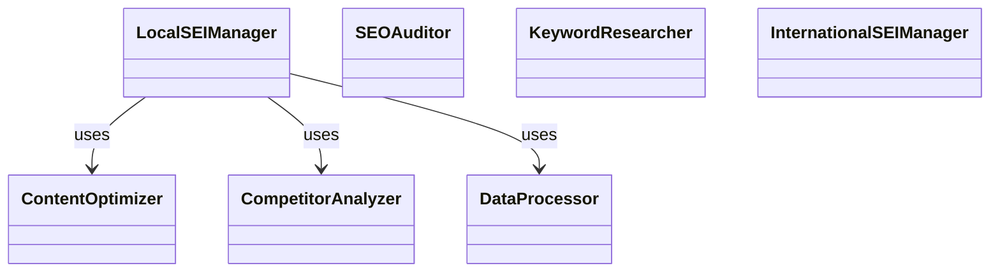

# 🚀 Uc Davis Seo Capstone

> UC Davis Search Engine Optimization (SEO) Specialization Capstone Project

[](https://img.shields.io/badge/)
[](https://img.shields.io/badge/)
[](https://img.shields.io/badge/)
[](https://img.shields.io/badge/)
[](https://img.shields.io/badge/)
[](https://img.shields.io/badge/)
[](LICENSE)

[English](#english) | [Português](#português)

---

## English

### 🎯 Overview

**Uc Davis Seo Capstone** is a production-grade Python application complemented by HTML that showcases modern software engineering practices including clean architecture, comprehensive testing, containerized deployment, and CI/CD readiness.

The codebase comprises **519 lines** of source code organized across **20 modules**, following industry best practices for maintainability, scalability, and code quality.

### ✨ Key Features

- **🏗️ Object-Oriented**: 8 core classes with clean architecture
- **📐 Clean Architecture**: Modular design with clear separation of concerns
- **🧪 Test Coverage**: Unit and integration tests for reliability
- **📚 Documentation**: Comprehensive inline documentation and examples
- **🔧 Configuration**: Environment-based configuration management

### 🏗️ Architecture

```mermaid
graph LR
    subgraph Input["📥 Input"]
        A[Raw Data]
        B[Feature Config]
    end
    
    subgraph Pipeline["🔬 ML Pipeline"]
        C[Preprocessing]
        D[Feature Engineering]
        E[Model Training]
        F[Evaluation]
    end
    
    subgraph Output["📤 Output"]
        G[Trained Models]
        H[Metrics & Reports]
        I[Predictions]
    end
    
    A --> C --> D --> E --> F
    B --> D
    F --> G
    F --> H
    G --> I
    
    style Input fill:#e1f5fe
    style Pipeline fill:#f3e5f5
    style Output fill:#e8f5e9
```





### 🚀 Quick Start

#### Prerequisites

- Python 3.12+
- pip (Python package manager)

#### Installation

```bash
# Clone the repository
git clone https://github.com/galafis/uc-davis-seo-capstone.git
cd uc-davis-seo-capstone

# Create and activate virtual environment
python -m venv venv
source venv/bin/activate  # On Windows: venv\Scripts\activate

# Install dependencies
pip install -r requirements.txt
```

#### Running

```bash
# Run the application
python src/main.py
```

### 🧪 Testing

```bash
# Run all tests
pytest

# Run with coverage report
pytest --cov --cov-report=html

# Run specific test module
pytest tests/test_main.py -v

# Run with detailed output
pytest -v --tb=short
```

### 📁 Project Structure

```
uc-davis-seo-capstone/
├── data/
│   ├── audit_results/
│   │   └── sample_audit.json
│   ├── competitors/
│   │   └── sample_competitors.json
│   └── keywords/
├── docs/          # Documentation
│   ├── api_documentation.md
│   ├── best_practices.md
│   └── seo_guide.md
├── src/          # Source code
│   ├── competitor_analysis/
│   │   ├── __init__.py
│   │   └── competitor_analyzer.py
│   ├── content_optimization/
│   │   ├── __init__.py
│   │   └── content_optimizer.py
│   ├── data_processing/
│   │   ├── __init__.py
│   │   └── data_processor.py
│   ├── international_seo/
│   │   ├── __init__.py
│   │   └── international_seo_manager.py
│   ├── keyword_research/
│   │   ├── __init__.py
│   │   └── keyword_researcher.py
│   ├── local_seo/
│   │   ├── __init__.py
│   │   └── local_seo_manager.py
│   ├── __init__.py
│   ├── main_platform.py
│   └── seo_audit.py
├── tests/         # Test suite
│   ├── integration_tests/
│   │   └── test_integration.py
│   ├── __init__.py
│   ├── performance_test.py
│   └── test_platform.py
├── LICENSE
├── README.md
└── requirements.txt
```

### 🛠️ Tech Stack

| Technology | Description | Role |
|------------|-------------|------|
| **Python** | Core Language | Primary |
| **NumPy** | Numerical computing | Framework |
| **Pandas** | Data manipulation library | Framework |
| **Plotly** | Interactive visualization | Framework |
| **scikit-learn** | Machine learning library | Framework |
| **Streamlit** | Data app framework | Framework |
| HTML | 1 files | Supporting |

### 🤝 Contributing

Contributions are welcome! Please feel free to submit a Pull Request. For major changes, please open an issue first to discuss what you would like to change.

1. Fork the project
2. Create your feature branch (`git checkout -b feature/AmazingFeature`)
3. Commit your changes (`git commit -m 'Add some AmazingFeature'`)
4. Push to the branch (`git push origin feature/AmazingFeature`)
5. Open a Pull Request

### 📄 License

This project is licensed under the MIT License - see the [LICENSE](LICENSE) file for details.

### 👤 Author

**Gabriel Demetrios Lafis**
- GitHub: [@galafis](https://github.com/galafis)
- LinkedIn: [Gabriel Demetrios Lafis](https://linkedin.com/in/gabriel-demetrios-lafis)

---

## Português

### 🎯 Visão Geral

**Uc Davis Seo Capstone** é uma aplicação Python de nível profissional, complementada por HTML que demonstra práticas modernas de engenharia de software, incluindo arquitetura limpa, testes abrangentes, implantação containerizada e prontidão para CI/CD.

A base de código compreende **519 linhas** de código-fonte organizadas em **20 módulos**, seguindo as melhores práticas do setor para manutenibilidade, escalabilidade e qualidade de código.

### ✨ Funcionalidades Principais

- **🏗️ Object-Oriented**: 8 core classes with clean architecture
- **📐 Clean Architecture**: Modular design with clear separation of concerns
- **🧪 Test Coverage**: Unit and integration tests for reliability
- **📚 Documentation**: Comprehensive inline documentation and examples
- **🔧 Configuration**: Environment-based configuration management

### 🏗️ Arquitetura


### 🚀 Início Rápido

#### Prerequisites

- Python 3.12+
- pip (Python package manager)

#### Installation

```bash
# Clone the repository
git clone https://github.com/galafis/uc-davis-seo-capstone.git
cd uc-davis-seo-capstone

# Create and activate virtual environment
python -m venv venv
source venv/bin/activate  # On Windows: venv\Scripts\activate

# Install dependencies
pip install -r requirements.txt
```

#### Running

```bash
# Run the application
python src/main.py
```

### 🧪 Testing

```bash
# Run all tests
pytest

# Run with coverage report
pytest --cov --cov-report=html

# Run specific test module
pytest tests/test_main.py -v

# Run with detailed output
pytest -v --tb=short
```

### 📁 Estrutura do Projeto

```
uc-davis-seo-capstone/
├── data/
│   ├── audit_results/
│   │   └── sample_audit.json
│   ├── competitors/
│   │   └── sample_competitors.json
│   └── keywords/
├── docs/          # Documentation
│   ├── api_documentation.md
│   ├── best_practices.md
│   └── seo_guide.md
├── src/          # Source code
│   ├── competitor_analysis/
│   │   ├── __init__.py
│   │   └── competitor_analyzer.py
│   ├── content_optimization/
│   │   ├── __init__.py
│   │   └── content_optimizer.py
│   ├── data_processing/
│   │   ├── __init__.py
│   │   └── data_processor.py
│   ├── international_seo/
│   │   ├── __init__.py
│   │   └── international_seo_manager.py
│   ├── keyword_research/
│   │   ├── __init__.py
│   │   └── keyword_researcher.py
│   ├── local_seo/
│   │   ├── __init__.py
│   │   └── local_seo_manager.py
│   ├── __init__.py
│   ├── main_platform.py
│   └── seo_audit.py
├── tests/         # Test suite
│   ├── integration_tests/
│   │   └── test_integration.py
│   ├── __init__.py
│   ├── performance_test.py
│   └── test_platform.py
├── LICENSE
├── README.md
└── requirements.txt
```

### 🛠️ Stack Tecnológica

| Tecnologia | Descrição | Papel |
|------------|-----------|-------|
| **Python** | Core Language | Primary |
| **NumPy** | Numerical computing | Framework |
| **Pandas** | Data manipulation library | Framework |
| **Plotly** | Interactive visualization | Framework |
| **scikit-learn** | Machine learning library | Framework |
| **Streamlit** | Data app framework | Framework |
| HTML | 1 files | Supporting |

### 🤝 Contribuindo

Contribuições são bem-vindas! Sinta-se à vontade para enviar um Pull Request.

### 📄 Licença

Este projeto está licenciado sob a Licença MIT - veja o arquivo [LICENSE](LICENSE) para detalhes.

### 👤 Autor

**Gabriel Demetrios Lafis**
- GitHub: [@galafis](https://github.com/galafis)
- LinkedIn: [Gabriel Demetrios Lafis](https://linkedin.com/in/gabriel-demetrios-lafis)
